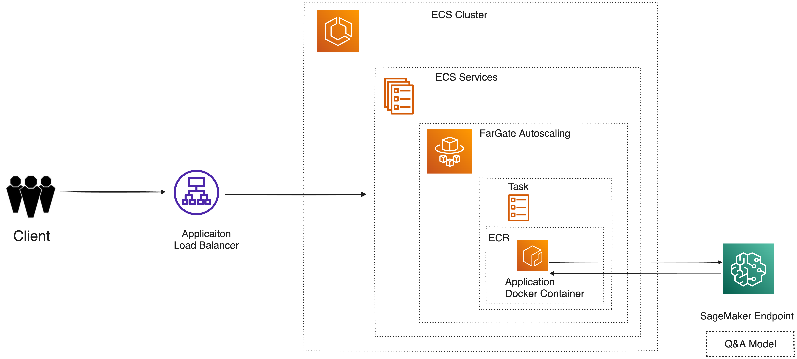
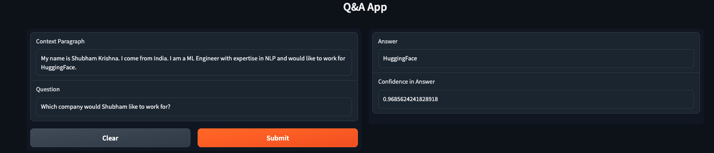

## Question 1 - Design and deploy a cloud-based machine learning application:
Design and implement a machine learning application on AWS or Azure that uses a Hugging
Face model for a real-world use case. You can choose any machine learning task and Hugging
Face model that you believe is relevant to your use case.
You will need to justify your choice of task and model and explain how they solve a real-world
problem. The application should be deployed on a scalable and fault-tolerant infrastructure, and
the deployment and infrastructure should be documented.

## Solution:

#### Use Case Selection
The chosen use case for this deployment is a Question-Answering (Q&A) system. Q&A systems are used to answer questions posed by users in natural language. I have chosen this use case because it is a common task in many real-world applications, such as chatbots, virtual assistants, and search engines. As, a lot of things can be expressed in the form of questions, Q&A systems can be used to provide answers to a wide range of queries. Obviously in today's world where we are surround by LLMs, the most commonly used application is a chatbot that can answer questions about a particular topic given a context.

 The aim is to provide a user-friendly interface where users can input questions, and the system responds with relevant answers given a context. The context can be a paragraph, but can be easily extended to documents like PDFs, webpages, etc.

#### Model Selection

For this Q&A system, I selected a Hugging Face model with the following configurations:

`model-id`: `distilbert-base-uncased-distilled-squad`
`task`: `question-answering`

This model is based on `DistilBERT`, which is a distilled and smaller version of the BERT model. It has been fine-tuned on the `SQuADv1.1` (Stanford Question Answering Dataset) dataset, making it well-suited for Q&A use case.

### Application Architecture

### Architecture Diagram

#### Web Application Deployment
The front-end of the application is deployed using AWS Elastic Container Service (ECS) **Fargate**. ECS Fargate provides a serverless container orchestration service, allowing us to deploy and manage containers without having to provision or manage the underlying infrastructure. This makes it easy to scale the web application based on traffic demands and ensures fault tolerance. A **Load Balancer** is employed to distribute incoming traffic across multiple ECS Fargate instances, ensuring high availability and redundancy. It also automatically handles traffic scaling as the number of incoming requests varies.

I have utilised **Gradio** to create a simple web interface for the Q&A system. The code for the web interface is available in the `app.py` file. A screenshot of the web interface is shown below:

#### Model Deployment

The model has been deployed on AWS **SageMaker Endpoints**. SageMaker provides the necessary infrastructure for model hosting and scaling. Auto-scaling based on CPU Utilization is also enabled on SageMakerEndpoints to ensure that the model can handle varying levels of inference requests. This is essential for maintaining responsiveness during periods of high usage. The script for deploying the model on SageMaker is available in the `deploy_model.py` file.

#### Infrastructure Deployment

Initially I used AWS UI to deploy the infrastructure. However, I later switched to using **Terraform** to automate the infrastructure deployment. Terraform allows us to define the desired state of our infrastructure in code, and makes it easy to deploy and manage the infrastructure. It also allows us to easily replicate the infrastructure across different projects. All the Terraform code is available in the `terraform` directory.

#### Other Components

For the purpose of this project, I have also created a **Docker** image for the web application. This allows us to easily deploy the web application on any platform that supports Docker. The Dockerfile is available in the `Dockerfile` file.  I have used the `upload_image.sh` script for uploading the Docker image to AWS ECR.